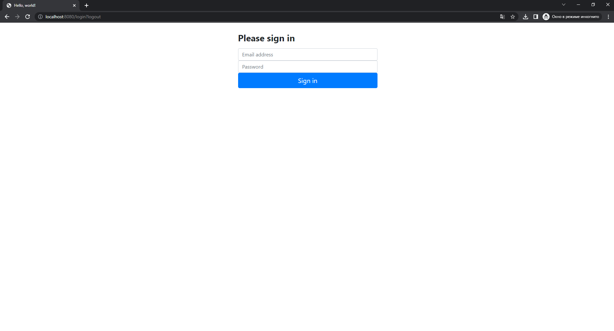
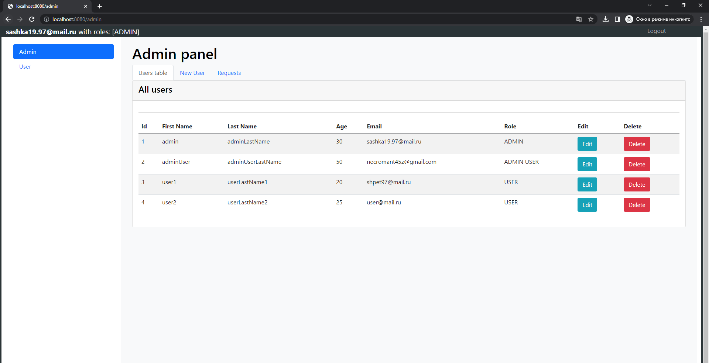
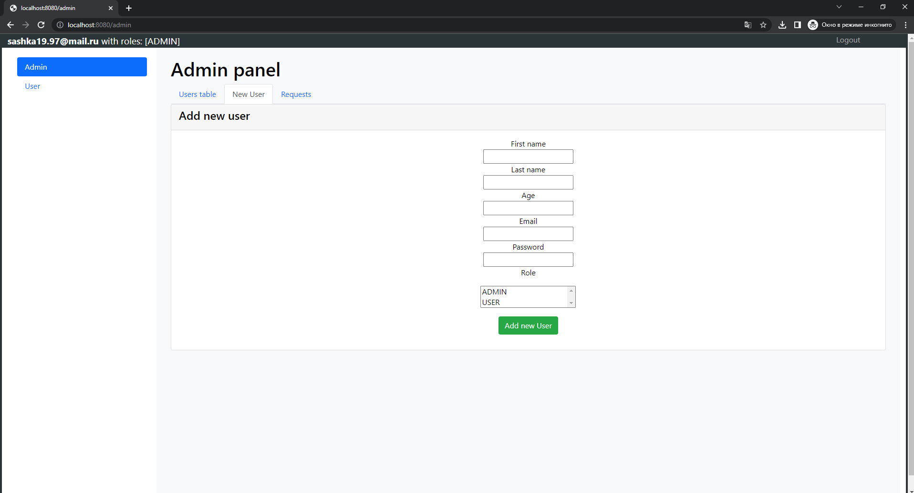
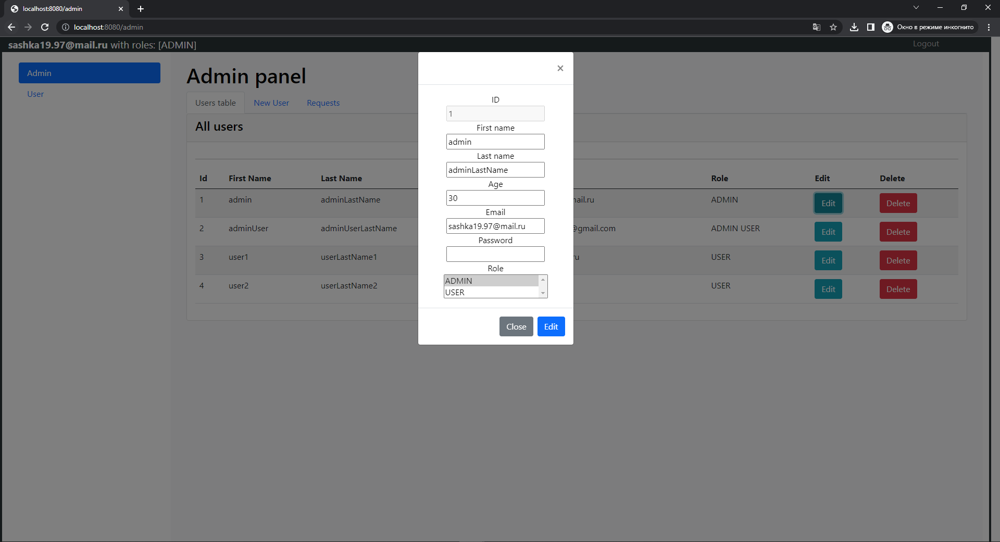
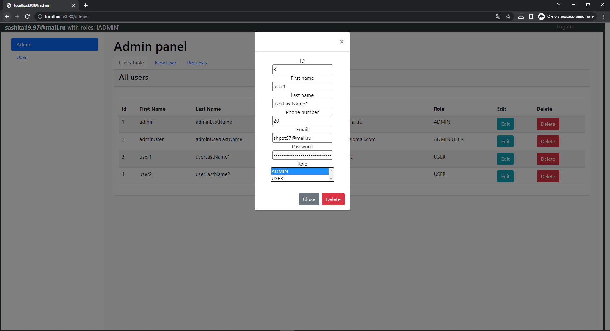
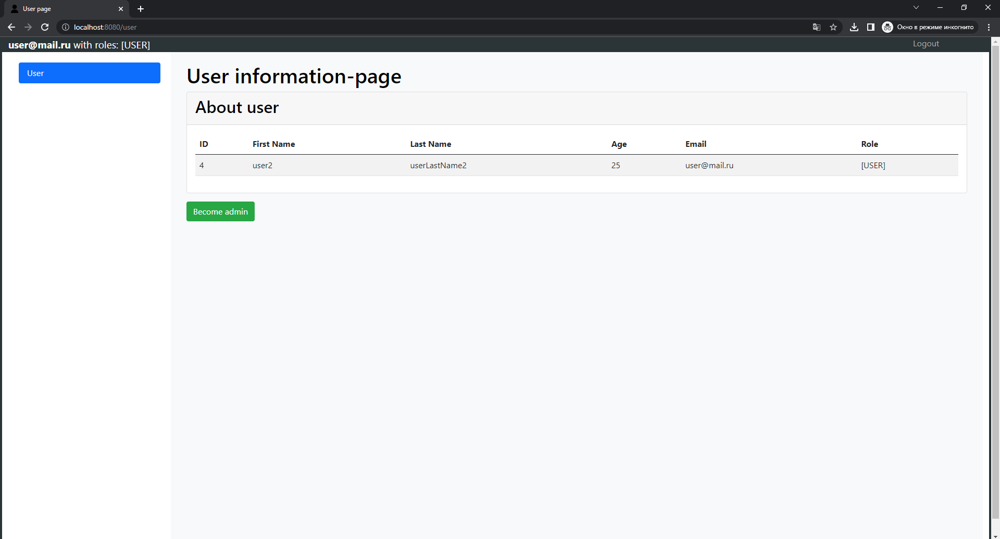
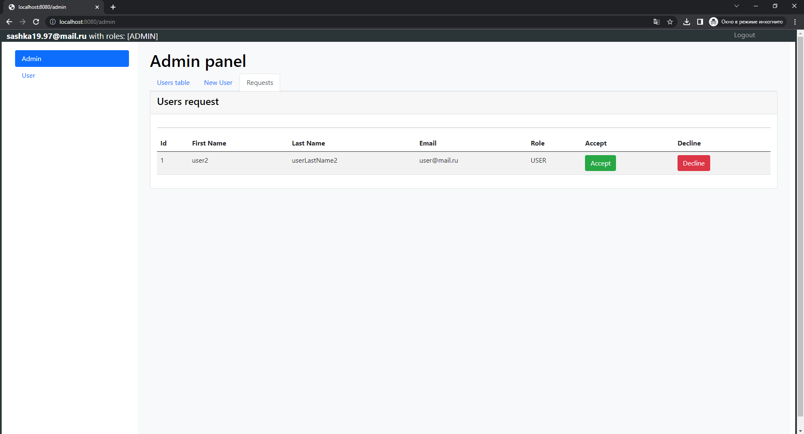

# CRUD application on Spring Boot
The application allows you to register, delete and change the user. As a user, you can view your own page, and as an administrator you can also view, edit, and delete other people's pages.

Technology Stack:
    Spring Boot (Data, Security, Mail, Thymeleaf, MVC, REST)
    DBMS (MySQL)
    Frontend (HTML, Bootstrap, JavaScript, jQuery, Ajax)
    
Main window

Tab for displaying the data of all users (as administrator)

Tab for adding a new user

Tab for user editing

Tab for deleting a user

Tab for displaying the data of the current user (as user)

Tab for displaying applications of users to get the role of administrator
